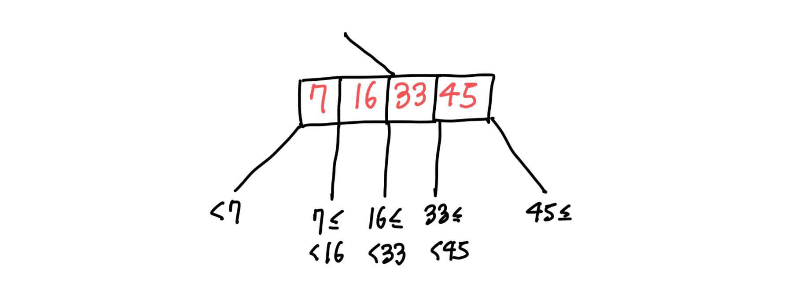

+++
title = "B-Tree, B+Tree"
date = 2024-05-26
description = "B-Tree, B+Tree와 자기 균형 이진 트리와의 차이점, 탐색·삽입·삭제 과정"

[taxonomies]
tags = ["data-structure", "tree"]

[extra]
series = "/series/csed233/"
+++

B-Tree, B+Tree와 자기 균형 이진 트리Self-Balanced Binary Tree와의 차이점을 알아본 다음, B-Tree에서 탐색, 삽입, 삭제 과정을 알아보겠습니다.

> 이 내용은 포항공과대학교의 CSED 233의 내용을 기반으로 하며, 수업과 차이가 있는 부분은 *기울임체*로 별도 명시하였습니다.

## B-Tree
B-Tree는 디스크 상에서 활용될 목적으로 개발된 탐색 트리의 일종입니다. 기본적인 아이디어는 이진 탐색 트리 하나의 노드에 여러 개의 데이터를 저장하는 것인데, 이러면 기본적인 속도는 Red-Black Tree 등 기존 이진 탐색 트리에 비해 느려지지만, 자료의 임의 접근Random Access (자료의 주소로 자료를 탐색) 과정과 자기 균형 횟수를 크게 줄일 수 있습니다.
HDD나 SSD 등의 디스크 드라이브는 자료의 임의 접근과 쓰기 속도가 굉장히 느린 대신, 순차 접근Sequential Access 속도는 비교적 빠르기 때문에 디스크에 저장되는 데이터들을 다루는 DBMS나 File System에서 주로 활용하는 자료구조입니다.

> 디스크 드라이브 이외에도 [메인 메모리](https://dl.acm.org/doi/10.1145/342009.335449)나 [GPGPU](https://link.springer.com/chapter/10.1007/978-3-642-33615-7_27) 등 cache-conscious indexing이 필요한 다양한 상황에서 B-Tree를 이용할 수 있는 듯 합니다.

### Probs
자기 균형 이진 트리와 비교해서는 선술하였듯, 자료의 임의 접근과 자기 균형 횟수를 줄여서 디스크에서 더 효율적이라는 장점이 있습니다.

정렬된 배열Sorted Array도 디스크에서 순차 접근이 용이하므로 사용할 수 있지만, B-Tree는 차지하는 디스크 공간이 약간 더 큰 대신 배열보다 업데이트가 빠르고 (전체 배열에서 정렬하는 것보다 트리 노드 내에서 정렬하는 것이 빠르므로) 데이터 탐색이 빠르다는 장점이 있습니다.

## B-Tree of order m
m진 탐색 트리는 아래와 같은 조건을 만족해야 합니다.
* 루트 노드는 최소 2개의 자식 노드를 가집니다.
* 루트 노드와 리프 노드를 제외한 중간 노드internal nodes는 최소 $\lceil x/2 \rceil$ 개의 자식 노드를 가집니다.
* 모든 리프 노드는 같은 레벨에 있습니다.

아래는 4진 B-Tree의 예시입니다.

탐색 트리이므로 아래와 같은 조건도 만족합니다.
* 첫 번째 서브 트리의 키는 첫 번째 키보다 작아야 합니다.
* N+1 번째 서브 트리의 키는 N 번째 키 이상이고, N+1 번째 키보다 작아야 합니다.
* 마지막 서브 트리의 키는 마지막 키 이상이어야 합니다.

### Analysis
B-Tree의 삽입, 삭제, 검색 연산은 $O(log_m\,n)$에 수행할 수 있습니다. 이때 $m$은 트리의 평균 가지 수branching factor가 됩니다.

### Implementation
B-Tree는 주로 디스크에서 구현한다고 했는데, 보통 한 노드가 하나의 디스크 블록을 차지하게 구현합니다. 여기서 블록은 메인 메모리와 디스크가 주고 받는 데이터의 단위입니다. *수업에서는 파일에 최대로 할당할 수 있는 연속적인 디스크 공간 이라고 설명했습니다.*  
디스크의 데이터는 블록 단위로 한 번에 메모리로 불러 들여올 수 있기 때문에, 블록 단위로 노드를 구성하는 것이 가장 적합합니다.

## B+Tree
B+Tree는 B-Tree와 비슷하되, 실제 데이터는 리프노드에만 저장하고, 루트노드와 중간노드에는 키만 저장하는 방식입니다. 데이터가 리프노드에만 저장되기 때문에 중복된 키도 허용됩니다. *추가로, 각 리프노드에 형제노드Sibling으로 가는 포인터를 주어 모든 데이터를 순회하는 것을 효율적으로 만듭니다.*

B-Tree와 비교해서 메모리 사용량과 요구 디스크 공간이 약간 커지는 단점이 있으나, 데이터의 순차 검색 성능이 매우 좋아집니다.

> NTFS, XFS, JFS2 FileSystem과 MySQL 등 관계형 데이터베이스 테이블의 인덱싱에 B+Tree를 이용합니다 

### B*Tree
B*Tree는 노드의 생성 최소화를 위하여 B+Tree에서 몇 가지의 제약 조건을 추가한 자료구조입니다. 자식 노드 수의 최소 개수는 $\lceil 2M/3 \rceil$개로 늘어나고, 노드가 가득 차면 노드 분할을 진행하는 B+Tree와 달리 형제 노드로 재배치를 우선적으로 진행합니다.

## 2-3 Tree
2-3 Tree는 B-Tree의 특수한 경우입니다. 3진 트리로서 모든 중간노드가 2~3개의 자식노드를 가지며, 마찬가지로 모든 리프노드는 같은 레벨에 정렬됩니다.

실제로 자주 쓰이는 형태는 아니지만, 2-3 Tree의 경우 B-Tree의 기본 연산들을 설명하기 쉽기 때문에 이런 형태를 가정합니다.

B-Tree로도 2-3 Tree를 구현할 수 있지만, B+Tree의 형태로 2-3 Tree를 구현한다고 생각하고 아래 설명을 진행하겠습니다.

### Search
탐색은 이진 탐색 트리와 유사하게 하면 됩니다. 2개의 노드와 키 값을 비교하여 왼쪽 자식노드, 중간 자식노드, 오른쪽 자식노드 중 하나를 선택하면서 내려가는 과정을 반복하면 됩니다. 시간 복잡도는 $O(log_3\,n)$ 입니다.

### Insert
삽입은 우선 데이터가 들어갈 노드를 찾는 것으로 시작합니다. 이때 노드에 빈 공간이 있는 경우와 없는 경우로 구분할 수 있는데, 노드에 빈 공간이 있는 경우는 그냥 그 자리에 데이터를 넣으면 됩니다.

노드에 빈 공간이 없는 경우에는 새로운 노드를 만들어 데이터를 삽입한 다음 균형을 맞춥니다.

### Delete
제거도 우선 데이터가 있는 노드를 찾는 것으로 시작합니다. 이때는 노드에 자식이 3개 있는 경우와 2개 밖에 없는 경우로 나누게 되는데, 3개 있는 경우는 그냥 없애면 되지만, 2개 있는 경우는 하나를 삭제해 버리면 B-Tree의 구조 조건 중 하나인 최소 $\lceil x/2 \rceil$ 개의 자식 노드 (2-3 Tree에서는 2개)를 충족하지 못하게 됩니다.

따라서 이 경우 형제노드의 남는 데이터를 끌어오거나 (형제노드의 자식이 3개인 경우)  값을 형재노드로 재위치시킨 후, 노드를 삭제하는 방법으로 데이터를 삭제합니다. (형제노드의 자식이 2개인 경우)

## Reference
* POSTECH CSED 233 : Data Structure
* [https://www.quora.com/Why-is-BTree-used-in-DBMS-not-BST-or-AVL](https://www.quora.com/Why-is-BTree-used-in-DBMS-not-BST-or-AVL)
* [https://yeongjaekong.tistory.com/38](https://yeongjaekong.tistory.com/38)
* [https://ko.wikipedia.org/wiki/B%2B_%ED%8A%B8%EB%A6%AC](https://ko.wikipedia.org/wiki/B%2B_%ED%8A%B8%EB%A6%AC)
* [https://www.quora.com/When-duplicate-keys-are-allowed-in-a-B-tree-what-are-the-changes-of-some-algorithms-when-compared-to-the-B-tree-with-no-duplicate-keys](https://www.quora.com/When-duplicate-keys-are-allowed-in-a-B-tree-what-are-the-changes-of-some-algorithms-when-compared-to-the-B-tree-with-no-duplicate-keys)
