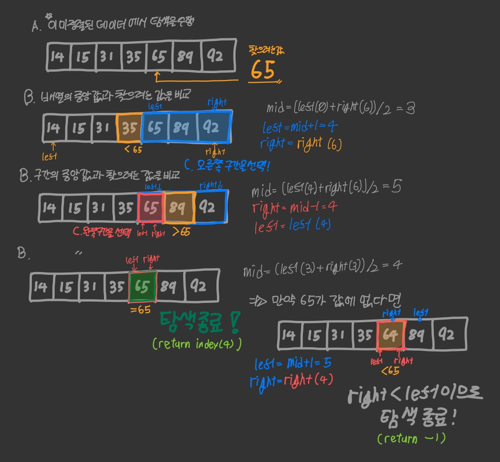

+++
title = "순차탐색과 이분탐색"
date = 2021-11-01
description = "순차탐색과 이분탐색 알고리즘을 알아봅니다."

[taxonomies]
tags = ["algorithm"]
+++

> !! 구 블로그 (Blogger) 에서 가져온 글입니다. 글 일부가 깨져보일 수 있습니다.

## 탐색이란?
탐색이란 데이터 구조 안의 저장된 정보를 찾는 것입니다.

대표적인 탐색 알고리즘에는 3가지가 있습니다.
* 순차탐색 (Sequential Search) — 혹은 선형탐색 (Linear Search)
* 이분탐색 (Binary Search)
* 해시탐색 (Hash Search)

이 글에서는 순차탐색과 이분탐색만을 다룹니다. 해시탐색은 언젠가 다룰 예정...

+: 3년이라는 시간이 걸렸지만 다뤘습니다.
[딕셔너리와 맵, 해싱](/blog/dictionary-and-hashing)

### 순차탐색 (Sequential Search)
순차탐색은 탐색알고리즘 중 가장 간단한 형태의 알고리즘이며, 선형탐색 (Linear Search) 라고도 합니다.

어떠한 데이터 배열이 있으면 데이터 배열의 처음부터 끝까지 모두 비교하여 자료를 찾아냅니다.

쉽게 말해서 그냥 배열 처음부터 끝까지 노가다.

**장점**
* 정렬되지 않은 배열에서 사용할 수 있다.
* 구현이 간편하다.

**단점**
* 데이터의 양이 많아지면 비효율적이다.

**순차탐색의 코드는 아래와 같습니다.**

```cpp
#include <stdio.h>
#define SIZE_OF_ARRAY 10

int array[SIZE_OF_ARRAY];

int main()
{
  /*array를 입력받는 코드 (전역변수이므로 초기값 0)*/
  int x; //x:배열에서 찾을 값
  scanf("%d",&x);
  
  int i; //i:인덱스
  for(i = 0; i<SIZE_OF_ARRAY; i++)
  {
    if(array[i] == x) printf("%d",i); //만약 array에서 x값을 찾으면 인덱스 값 출력
  }
}
```

<details>
<summary><strong>위의 내용을 함수로 만든 코드 스니펫 (클릭)</strong></summary>

```cpp
int SequentialSearch(int* array, int n, int x)
  //arr:배열포인터, n:배열의 길이, x:찾을 값
{
  for(i = 0; i<n; i++)
  {
    if(array[i]==x) return i; //만약 x를 찾으면 인덱스를 반환
  }
  return -1; //찾지 못했으면 -1을 반환
}
```

</details>

### 이분탐색 (Binary Search)

이분탐색은 **정렬된 데이터**에서 쓸 수 있는 탐색 알고리즘으로, 찾고자 하는 값을 가운데 값과 비교해서 그 값이 왼쪽에 있는지 오른쪽에 있는지 파악하여 자료를 찾습니다.

**장점**
* 순차탐색에 비해 탐색속도가 빠르다.

**단점**
* 데이터가 미리 정렬되어 있어야 한다.
* 데이터의 임의접근(Random Access)이 가능해야한다. — 데이터에 몇개의 요소가 있는지에 관계없이, 모든 요소에 대해 같은 시간 내에 접근 할 수 있는 접근 방식, C언어의 배열은 임의접근이 가능하며, 연결리스트와 같은 특정 자료구조는 불가능하다. (어렵다면 지금은 무시해도 좋다.)

이분탐색의 대략적인 의사코드는 다음과 같습니다.

1. 배열의 중앙값과 찾으려는 값을 비교한다.
2. 만약 찾으려는 값이 더 작다면 왼쪽 부분, 더 크다면 오른쪽 부분을 선택한다. 같다면 탐색을 종료한다.
3. 선택한 구간의 중앙값과 찾으려는 값을 비교한다. -> B로 돌아간다.



이분탐색은 재귀함수와 반복문, 두 가지 방법으로 구현할 수 있습니다.

**이분탐색의 반복문 구현**

```cpp
#include <stdio.h>
#define SIZE_OF_ARRAY 10

int array[SIZE_OF_ARRAY]

int main()
{
  /*array를 입력받는 코드 (전역변수이므로 초기값 0)*/
  int x; //x:배열에서 찾을 값
  scanf("%d",&x);
  
  int left=0, right=SIZE_OF_ARRAY-1, mid;
  while(left<=right) //left가 right 이하 일때 반복
  {
    mid=(left+right)/2;
    if(array[mid]==x) printf("%d",mid); //찾으면 index 출력
    else if(array[mid] > x) right=mid-1;
    else if(array[mid] < x) left=mid+1;
  }
  printf("Not Found\n"); //찾지 못할 경우 출력
}
```

<details>
<summary><strong>위의 내용을 함수로 만든 코드 스니펫 (클릭)</strong></summary>

```cpp
int BinarySearch(int* array, int n, int x)
  //arr:배열포인터, n:배열의 길이, x:찾을 값
{
  int left=0, right=n-1, mid;
  while(left<=right) //left가 right 이하 일때 반복
  {
    mid=(left+right)/2;
    if(array[mid]==x) return mid;
    else if(array[mid] > x) right=mid-1;
    else if(array[mid] < x) left=mid+1;
  }
  return -1;
}
```

</details>

**이분탐색의 재귀함수 구현**

```cpp
#include <stdio.h>
#define SIZE_OF_ARRAY 10

int array[SIZE_OF_ARRAY]

int RecursiveBinarySearch(int left, int right, int x)
{
  int mid;
  if(left>right) return -1;
  mid = (left+right)/2;
  
  if(x==array[mid]) return mid;
  else if(array[mid]>x) return RecursiveBinarySearch(left, mid-1, x);
  else if(array[mid]<x) return RecursiveBinarySearch(mid+1, right, x);
}

int main()
{
  /*array를 입력받는 코드 (전역변수이므로 초기값 0)*/
  int x; //x:배열에서 찾을 값
  scanf("%d",&x);
  printf("%d",RecursiveBinarySearch(0,SIZE_OF_ARRAY,x));
}
```

<details>
<summary><strong>위의 내용을 함수로 만든 코드 스니펫 (클릭)</strong></summary>

```cpp
int BinarySearch(int* array, int n, int x)
    //arr:배열포인터, n:배열의 길이, x:찾을 값
{
  int mid;
  if(left>right) return -1;
  mid = (left+right)/2;
  
  if(x==array[mid]) return mid;
  else if(array[mid]>x) return BinarySearch(left, mid-1, x);
  else if(array[mid]<x) return BinarySearch(mid+1, right, x);
}
```

</details>
