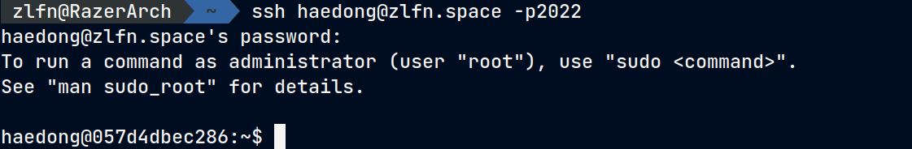

+++
title = "Docker를 이용한 리눅스 실습 환경 구축"
date = 2023-08-29
description = "동아리 후배들을 위한 리눅스 세미나 실습 환경을 Docker로 구축한 경험"

[taxonomies]
tags = ["linux", "docker"]
+++

동아리에서 후배들에게 리눅스 세미나를 하게 되었습니다. 그러면 실습 환경 구축을 해야겠죠.

제작년에는 선배들이 버추얼 박스를 설치해 오라고 시켰고, 작년에는 똑같이 제가 세미나를 맡아서 후배들에게 제 리눅스 서버 계정을 하나씩 넘겨주는 방식으로 실습을 했는데요,

올해는 제 리눅스랑 가상화 지식이 많이 늘기도 했고, [서버도 깔끔하게 재구축했으니](https://zlfn.space/blog/rocky-linux) 가상화를 통해 1인 1서버를 주는 걸 만들어보기로 했습니다.

### 구글링
원래는 컨테이너를 여러개 열어서 SSH 리버스 프록시나 점프 포워드로 구축해 보려고 했는데, 생각보다 어려워서 고전하던 중, 아래 글을 발견하게 되었습니다.

[Replicate and Isolationg user environments on the fly](https://unix.stackexchange.com/questions/126426/replicate-and-isolating-user-environments-on-the-fly)

제가 딱 원하던거여서, 이 내용을 기반으로 환경에 맞게 수정해서 구축하기로 했습니다.

### 이미지 만들기
위 글에서는 컨테이너를 수정하고 그걸 다시 이미지로 만드는 과정을 거쳤는데, 그건 너무 귀찮아서  Dockerfile로 구성하기로 했습니다.

``` dockerfile
# Dockerfile
FROM ubuntu:latest

RUN apt-get update
RUN apt-get install -y vim sudo man-db gcc
RUN yes | unminimize

RUN useradd -ms /bin/bash guest
RUN echo 'guest:password' | chpasswd
RUN usermod -a -G sudo guest

USER guest
WORKDIR /home/guest
```

실습에 필요한 패키지인 `vim`, `sudo`, `man-db`, `gcc` 를 깔고, `unminimize`를 수행해서 `man`이 동작하게 만듭니다.

그리고 guest 라는 유저를 만들어서 컨테이너에 접속하게 되면 루트가 아니라 유저로서 접속하게 합니다. 이러면 ssh로 직접 접속하는거랑 더 비슷한 느낌을 줄 수 있겠죠.

```bash
docker build --tag sandbox .
```

로 이미지를 빌드합니다.

### 유저 만들기
이제 유저를 만들어서, SSH로 접속하게 되면 가짜 셸에 접속하게 합니다.
```bash
mkdir /home/guest

cat > /home/guest/sandbox <<EOF
#!/bin/sh
exec docker run -t -i --rm=true sandbox /bin/bash
EOF

chmod +x /home/guest/sandbox

# useradd guest -g docker -s /home/guest/sandbox 
useradd guest -s /home/guest/sandbox

chown guest /home/guest

passwd guest
```

저는 Docker가 아니라 Podman 환경이어서, 유저에게 `docker` 그룹을 주지 않아도 [Rootless Podman](https://access.redhat.com/documentation/ko-kr/red_hat_enterprise_linux/8/html/building_running_and_managing_containers/proc_setting-up-rootless-containers_assembly_starting-with-containers)을 실행할 수 있었습니다. Docker로 구성할 경우 `docker` 그룹을 주는게 필요하겠네요.

`docker` 명령어에는 `--rm=true` 인자를 붙혀서 도커 컨테이너에서 나갈 경우 바로 컨테이너가 삭제되도록 하고, 유저가 들어오면 가짜 셸을 실행해서 도커를 열게 합니다.

### 완성
위 설정대로 구축하고, `guest`유저로 ssh 접속하게 되면 임시 생성된 컨테이너에 가둬지게 됩니다.



(블로그에 쓴 것과 유저 이름은 다릅니다.)

이 환경에서는 원하는 만큼 패키지를 설치하거나 (커널에 관련된 것만 아니면) 시스템을 수정할 수 있고, `sudo rm -rf /`를 수행해도 컨테이너를 실행하는 시스템에는 아무런 영향이 가지 않습니다.

나왔다 들어오면 모든 내용이 초기화되고 새 컨테이너를 생성하니 실습하기 좋은 환경이죠.

```
sudo rm -rf --no-preserve-root /
```
을 실행해보고 시스템이 박살나지 않는지 확인해 봅시다.

### 2024.07.15 추가

위와 같이 컨테이너를 구축하면 로그아웃 할 때 가끔 컨테이너가 제대로 지워지지 않는 문제, 로그인 할 시에 Refreshing Error가 발생하는 문제가 있습니다.
```
ERRO[0001] Refreshing container 2e3d121a75ec00add6a35694cdc26e6442bb98a7e993b918569dd7584597bca6: acquiring lock 0 for container 2e3d121a75ec00add6a35694cdc26e6442bb98a7e993b918569dd7584597bca6: file exists
```

로그아웃 할 때 컨테이너가 지워지지 않는 문제는 `guest` 계정의 `.bash_logout` 파일에 `docker stop sandbox`를 적었는데, 일단 확실하진 않지만 해결이 된 것 같고,
에러는 `loginctl enable-linger guest`를 통해 계정의 lingering mode를 허용해 주면 해결되는 듯 합니다.
