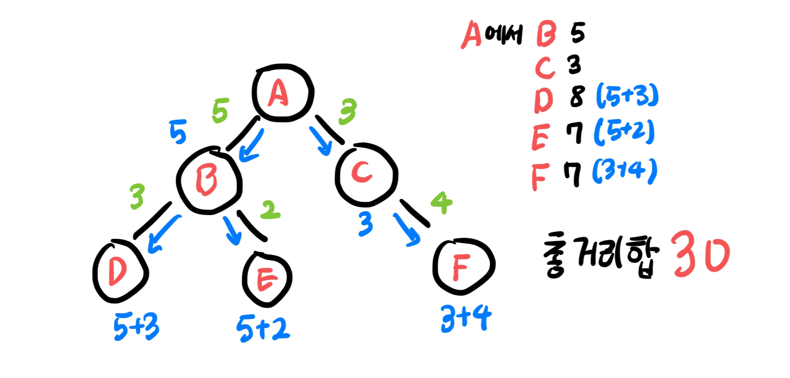
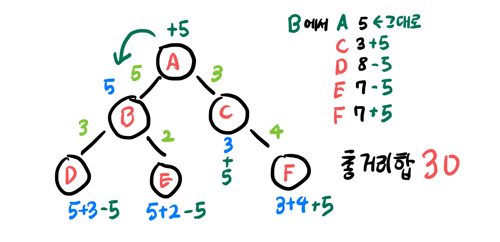

+++
title = "木のリルーティング（全方位木DP）"
date = 2024-04-12
description = "リルーティングテクニックを用いた木DPの問題解法"

[taxonomies]
tags = ["algorithm", "tree", "DP"]
+++

[AtCoder ABC #348](https://atcoder.jp/contests/abc348)の[E - Minimize Sum of Distance](https://atcoder.jp/contests/abc348/tasks/abc348_e)で木DP、その中でも全方位木（<ruby>全方位木<rp>（</rp><rt>ぜんほういき</rt><rp>）</rp></ruby>）DPを使うということで調べてみました。

このアルゴリズムは日本国外では**Rerooting**と呼ばれ、根が定まっていない木で条件に合う根を求める際に便利に使えるテクニックです。韓国では木でのダイナミックプログラミングの一種として扱われますが、海外では名前を付けるほど競技プログラミングで意外と頻出するアルゴリズムのようです。

## 概念
### 木DFS
まず特定のノードについて**他のノードまでの辺コストの総和**を求める方法を考えましょう。これはDFS+DPで$O(n)$で実装できます。


### リルーティング
では**他のノードまでの辺コストの総和が最も小さい**ノードはどう求められるでしょうか？上で説明した木DFSをノード数だけ使えばいいですが、それでは$O(n^2)$かかり、頂点が$10^5$個を超えるとTLEになります。  
まさにこの時**リルーティングテクニック**を使います。DFS+DP木の根を移すことが$O(1)$で可能であることを利用するテクニックです。

上の図で、Aノードの総距離和30を使ってBノードの総距離和を求めてみましょう。Aノードとその向こうにあるA(0), C(3), F(7)ノードの距離はA-B辺のコスト5だけ増加してA(5), C(8), F(12)になり、Bノードとその下にあるB(5), D(8), E(7)ノードの距離はA-B辺のコスト5だけ減少してB(0), D(3), E(2)になります。Aノードの増加分とBノードの減少分は相殺されるので、  
つまり`(Aの総距離和) - {(Aノードの向こうのノード数) - (Bノードの下のノード数)} * (A-B辺のコスト)}`がBノードの総距離和になるわけです。



この方法でAノードの総距離和を知っている時、Bノードの総距離和を$O(1)$で求められます。  
このテクニックを根を移すと考えるとリルーティングテクニック、双方向に探索しながらDFSを回すと考えると全方位木DPという名前になります。アルゴリズムは大体そうですが、名前はあまり重要ではありません。

ここでAノードの向こうのノード数とBノードの下のノード数は、Aの総距離和を求める最初のDFSの時に**サブノードの個数を一緒に保存**しておけば求められます。上の例で言えば、`Aのサブノード数` - `Bのサブノード数`がAの向こうのノード数、`Bのサブノード数`がそのままBノードの下のノード数になりますね。

## 例題

### [BOJ 27730 : 牽牛と織女](https://www.acmicpc.net/problem/27730)

上の例をそのまま適用できる問題です。木2つに対して実行し、両側で距離和が最も小さいノードを出力すればOKです。
 
### [BOJ 7812 : 中央木](https://www.acmicpc.net/problem/7812)

中央ノードをリルーティングで求めた後、再度DFSを回して全ノードからの距離を出力すればOKです。


### [ABC#348 E](https://atcoder.jp/contests/abc348/tasks/abc348_e)

リルーティングテクニックという名前を初めて知った問題で、辺のコストではなく**頂点のコスト**が与えられます。
つまり`(該当頂点に行くのに必要な辺数) * (頂点のコスト)`が辺のコストになります。  
この問題は頂点のコスト和`c[x]`と距離和`c[x]*d`を両方記憶しながら解けばOKです。
整理した正解コードは以下の通りで、解説は[エディトリアル](https://atcoder.jp/contests/abc348/editorial/9774)を参照してください。

```cpp
#include <bits/stdc++.h>
using namespace std;
#define llint long long int
int main() {
    int n;
    cin >> n;
    vector<int> a(n - 1), b(n - 1);
    vector<vector<int>> tree(n);
    for (int i = 0; i < n - 1; i++) {
        cin >> a[i] >> b[i];
        a[i] -= 1;
        b[i] -= 1;
        tree[a[i]].push_back(b[i]);
        tree[b[i]].push_back(a[i]);
    }

    vector<llint> c(n);
    for (int i = 0; i < n; i++)
        cin >> c[i];

    //sum_c[i]はiを根とする木に対して頂点c[x]の和
    //sum_d[i]はiを根とする木に対してc[x] * d(i, x)の和
    vector<llint> sub_sum_c(n), sub_sum_d(n);
    auto dfs
    =[&](auto &&self, int v, int par) -> pair<llint, llint> {
        //v: 現在のノード、par: 親ノード
        for (int t: tree[v]) { //全ての下方向ノードに対して
            if (t == par) continue; //親方向には行かない
            auto [child_sum_c, child_sum_d] = self(self, t, v);
            sub_sum_c[v] += child_sum_c; //下方向cを累積
            sub_sum_d[v] += child_sum_d; //下方向dを累積
        }
        sub_sum_d[v] += sub_sum_c[v]; //再帰的にc[x]がd(i, x)回合計される
        sub_sum_c[v] += c[v];
        return {sub_sum_c[v], sub_sum_d[v]};
    }; dfs(dfs, 0, -1); //根からdfs、0(1)番ノードを根として扱う

    //dfsで全ノードに対してf(n)を求める
    vector<llint> f(n);
    auto reroot
    =[&](auto &&self, int v, int par, llint par_sum_c, llint par_sum_d) -> void {
        //v: 現在のノード、par: 親ノード、par_sum_c: 上方向へのc和、par_sum_d: 上方向へのd和
        f[v] = sub_sum_d[v] + par_sum_d;
        for(int t : tree[v]) { //全ての下方向ノードに対して
            if(t == par) continue; //親方向には行かない
            llint nc = par_sum_c //vの上方向へのc和
                    + sub_sum_c[v] //vの下方向へのc和
                    //ここまで全ノードのc和
                    - sub_sum_c[t]; //tの下方向へのc和を引く
                    //nc : tの上方向へのc和
            llint nd = par_sum_d //vの上方向へのd和
                    + sub_sum_d[v] //vの下方向へのd和
                    - sub_sum_d[t] - sub_sum_c[t] //tの両方向d和を引く
                    //ここまでtがvの位置にいた時のsum_d
                    + nc; //tの上方向へのc和
                    //nd : tの上方向へのd和
            self(self, t, v, nc, nd);
        }
    }; reroot(reroot, 0, -1, 0, 0);

    cout << *min_element(f.begin(), f.end()) << endl;
}
```

## 参照
* [Codeforces - Rerooting Technique](https://codeforces.com/topic/76681/en17)
* [nicotina04 - Rerooting Technique on Tree](https://nicotina04.tistory.com/169)
* [Codeforces - Online Query Based Rerooting Technique](https://codeforces.com/blog/entry/76150)
